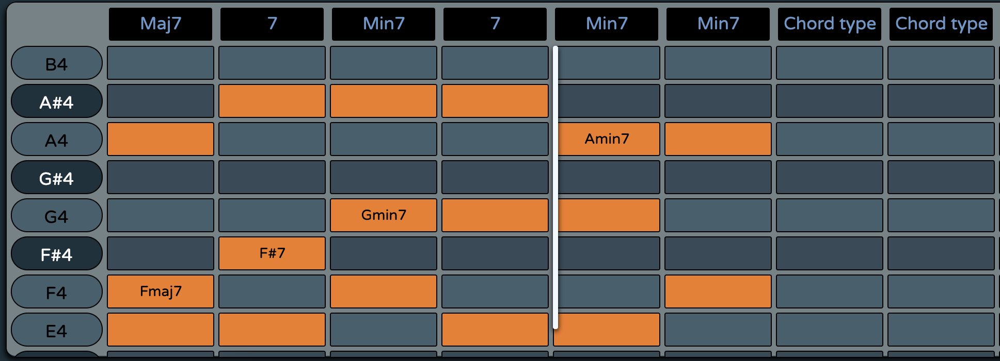

# Harmonic Tension Visualizer

## Introduction

The goal of our project is to analyze a chord sequence, given by the user through an intuitive piano-roll interface, in order to determine the trend of the harmonic tension. Following different criteria, estabilished by us and based on music theory, we assign to each chord a certain level of tension, influenced by:
*	the chord's composition,
*	well-known progression patterns,
*	the harmonic context

After these computations, the results of our analysis are graphically represented with dynamic visual effects while the chord progression is being played.

## Technologies used
Our project is a web application completely developed using HTML, JS and CSS. We used HTML in order to define the static interface and structure of the page, CSS to apply some style attributes to the page components and JS to render the dynamic components of the page and manage all the user interactions with the page.

In order to implement audio features, we used an external JS framework named Tone.js. It can be defined as a Web Audio framework for creating and manipulate dynamically sounds and music in a web page. Thanks to the high semplicity of this kind of framework-architecture, it is possible to create web-based audio applications. On the high-level, Tone offers common DAW (digital audio workstation) features like a global transport for synchronizing and scheduling events as well as prebuilt synths and effects. Additionally, Tone provides high-performance building blocks to create your own synthesizers, effects, and complex control signals.

In particular, we made use of Tone.Sampler that allows to combine different samples into a single more complex instrument (a piano in our case).

## User interface

The structure of the project can be divided into four main parts:

-	piano roll
-	button bar 
-	tension graphic representation
-  readme

## Piano roll

This is a dynamic component added when the page is loaded for the first time. It consists of a table of buttons, each one corresponding to a note distributed over 3 octaves, from C2 to B4.
Users can enter the chord sequence to analyze using this simple piano-roll interface in a few passages:
-	select the tonic note of the chord
-	select the type of the chord: triads(minor, major, diminished) or quadriad (major7, minor7, 7, diminished, half diminished)
-	complete the chord manually choosing between the possible notes selectable shown graphically or click the next tonic note in the next column to complete the previous chord automatically in its fundamental position

## Button bar

At the top of the page the user can find a list of buttons, each one with a specific function:
-	Info: brings the user at the bottom of the page where there is a brief description of the project
-	Play: begins the reproduction of the chord sequence, the scrolling of the piano-roll, the analysis of the harmonic tension and the visualization of the computation results
- Play faster: doubles the reproduction speed
-	Pause: stops the reproduction
-	Rewind: brings back the reproduction at the starting point
-	Volume mute: mutes the volume 
-	Volum down: decreases the volume (untile a min volume value threshold)
-	Volume up: increases the volume (until a max volume threshold)
-	Reset: cleans the piano-roll content 
-	Download: to download a .txt file containing the progression you put into the piano roll
-	Upload: to upload a .txt file you have on your computer that contains a progression you saved

## Sampler

As previously mentioned, all the audio options and features have been realized with Tone.Js. 
Despite its extreme-intuitivity structure and organization, Tone.js allows to create, develop and then process a wide range of different sounds, each one of them can be affected by some effects.
Once installed Tone.js (or imported it inside the js file in which you want to use it), it is possibile to create sounds by using synthetizer(FM or AM) by code as follows:

Due to the fact that we need a synthetizer able to play multiple notes at the same time instant (simultaneously), we cannot use any monophonic synthetizer available in Tone.Js and implement only a possible polyphonic synthetizer (or a combination of multiple of more of them). A better solution that allows us to personalize the sound produced when every single note has been played, is represented by Tone.Sampler. In order to implement it, it is necessary not only to declaire a "Sampler object" but also to create an association (called binding) between every note available( that can be played in the web audio page) and the sound that the Sampler object has to play. The following piece of code shows exactly how to create a piano Sampler object and how to realize the binding between samples and notes:

Tone.js allows us to set and personalize further the sound of the Sampler object by using the set parameter: inside it you can specify options and values to be set such as Volume, Attack, Sustain, Release, detune, and other musical options that can be applied to the instrument.

Once the all the previous phases has been setted up, it is necessary, as for all the web-audio frameworks, to connect the Sampler object to the output channel: this operation can be done by the command toMaster();. It is important to remark that this command must be placed only after the other parameters and settings have been created, as a conclusion of all the processes of the audio object.

Until now, the object has been created, initialized and personalized by modifiying some attributes. Finally it is also important to play notes and reproduce some sounds when necessary. This can be done by using the triggerAttackRelease() function. Inside the function, you have to insert the list of notes to be played and, as an optional property, it is possible to set the duration of the note in terms of time.  

## Tension graphic representation (canvas e specchietti con degree e pattern)

/* image */

To represent graphically the tension generated by each chord of the progression, we used a canvas API to dynamically generate a moving sine wave. Multiple parameters of the sine wave are governed by the tension value of the chord and normalized with the maximum tension. These parameters are the amplitude, the wave length and the propagation speed. The sine wave is then multiplied by a hanning window to be given the particular shape that can be seen on the picture.

(colour part)

After being generated, the function is drawn on the canvas with a refresh rate of approximately 30 frames per second.

Additionally, the results of the harmonic analysis of the progression such as the chord degree, it's eventual substitution or the pattern it's part of can be seen live under the button bar.

## Harmonic Analysis
First of all, this project does not intend to analyze faultlessly every possible chord progression given by the user. 
Instead, we tried to build a versatile algorithm that works well with progressions with a small amount of "harmonic alterations" (that will be discussed below).
The main function, contained in `harmonicAnalysis.js`, is executed every time the PLAY button is clicked. It can be dividen in 4 parts:
#### Phase 1: select keys with highest number of compatible chords
...
#### Phase 2: choose the key with highest number of correct chords before the first wrong one
...
#### Phase 3: analyze each "wrong" chord, based on the chosen key, with different options

...
#### Phase 4: assign tension to each chord
...

## Surge

Our project is online on Surge, a free platform that allows you to publish online your web site for free.  
Try it [here](http://harmonytensionvisualizer.surge.sh)!

## Video demo
*coming soon*
Here(link) you can find a short video demo 

## Group components:
•	Francesco Zumerle
•	Hakim El Achak
•	Elisa Castelli
•	Simone Lucchiari
